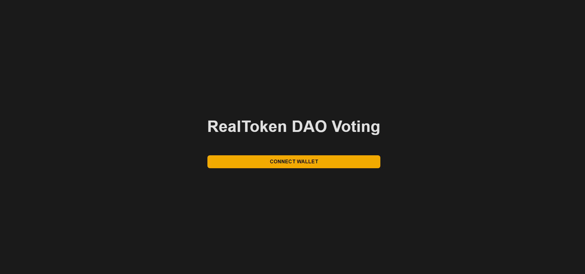
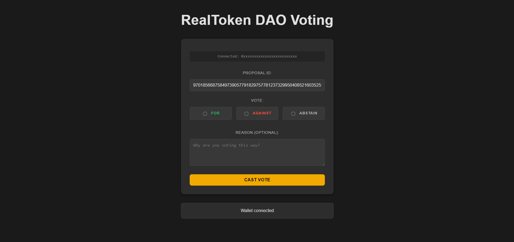

# Voting Interface Realtoken

This project aims to enable voting within the RealToken DAO. We use functions 3 (castVote) and 5 (castVoteWithReason) from the following contract: https://gnosisscan.io/address/0x4a5327347f077e72d2aab19f68ba8a7f12ec5d63#writeProxyContract.  

You must vote using the address that holds the voting power.  

In the "proposalId" parameter, enter the ID, for example: 97018566875849739057791829757781237329950408521603525975301422956278121248932.  

Set the "support" parameter to 0 for AGAINST, 1 for FOR, or 2 for ABSTAIN.

## Run project 

make dev-run 
make dev-kill 

Available in http://localhost:5173/

## Technologies

- Vue 3 + Vite
- Docker
- Makefile
- ethers.js

## Screenshots

- Example 1

- Example 2

